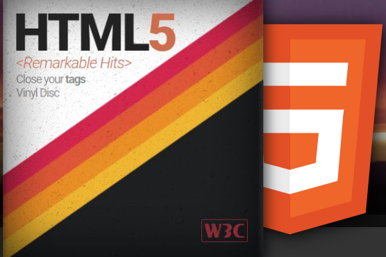
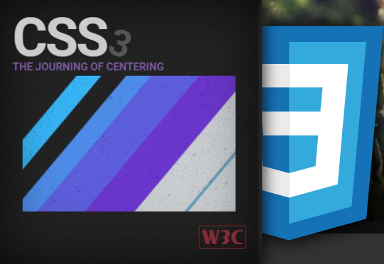
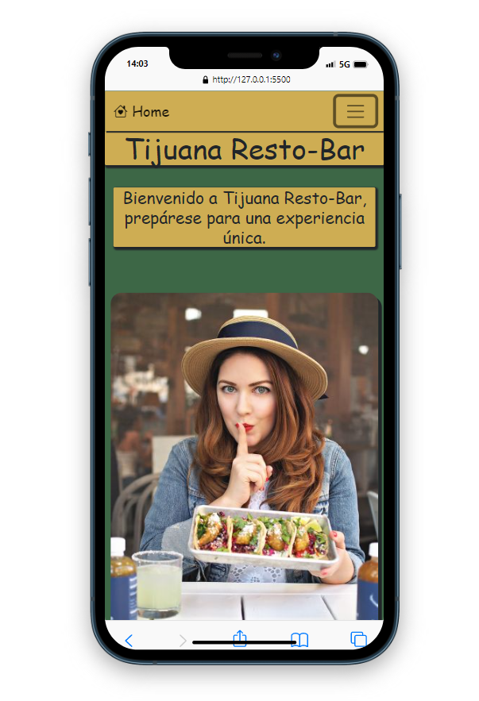
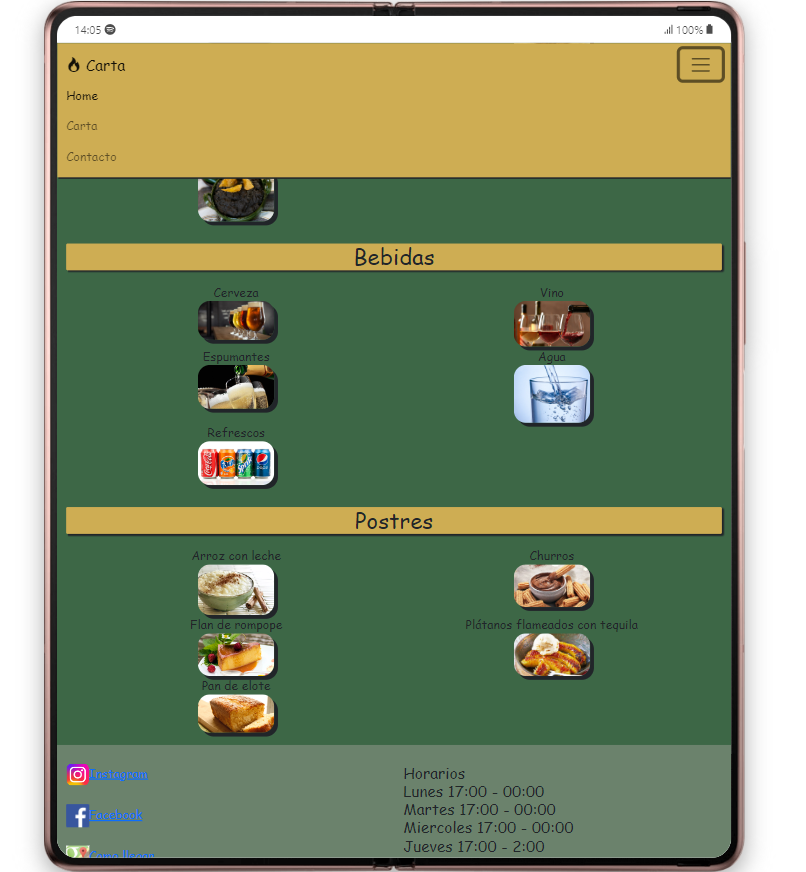
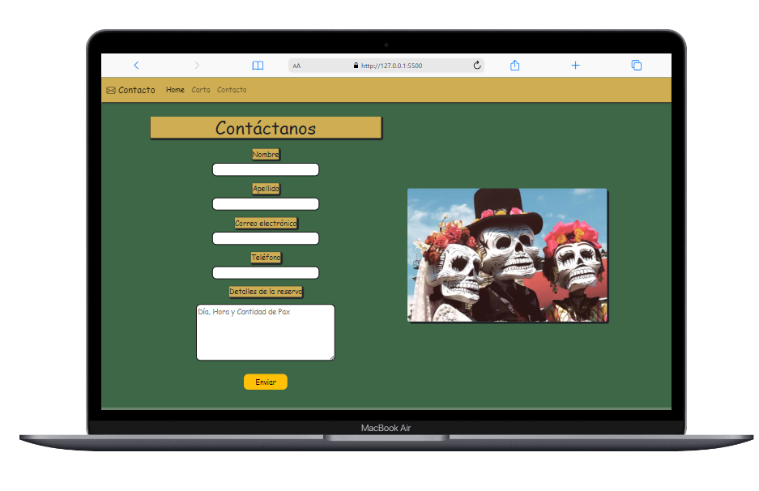

# Resto-Bar Tijuana

## Table of Contents

- [Introducción](#about)
- [Especificaciones](#getting_started)
- [Stack](#stack)
- [Images](#images)

## Introducción <a name = "about"></a>
<h1></h1>

Creamos este proyecto con el objetivo de raelizar la web del RestoBar Tijuana y su  carta incorporada, de manera que sea Responsive tanto para pantalla de móvil (first), tablet y PC o de mayor tamaño.
<br>
<br>
## Especifiaciones <a name = "getting_started"></a>

<h1></h1>

<h3>
<li> Se puede acceder a dicha web desde cualquier dispositivo. </li>
</h3> <br>

## Stack <a name = "stack"></a>
<h1></h1>
 <h3><li>Como base de la estrucura se utilizó
<a href="https://lenguajehtml.com/">
    
</a>, para la creación de estilos fue <a href="https://lenguajecss.com/" target="_blank" >
    
</a> y para hacer la web responsive mediante <a href="https://getbootstrap.com/docs/5.0/getting-started/introduction/" target="_blank"> </a>.
</h2></li>
<br>


 ## Images <a name = "images"></a>
<h1></h1>
<br>
<br>



<br>
<br>
<br>

```
Comienza con el menú Hamburguesa hasta pantallas de 992px (tamaño lg en boostrap)
```
<br>
<br>
<br>

<br>
<br>
<br>

```
Variacion de posicionamiento trabajado con boostrap
```
<br>
<br>



<br>
<br>
<br>

```
Vista previa desde pantallas lg (992px) en adelante
```
<br>
<br>
<br>

<h3>
<li> Cick aquí para ver el <a href="https://franciscocampana1.github.io/cartaRestaurant/">Demo</a></li>
</h3>